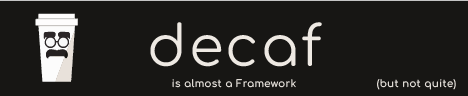

## Storybook generator

### ***Initial Setup***

#### if you use github

create a new project using this one as a template.

clone it `git clone <project>` and navigate to the root folder `cd <project>`

### Installation

Run `npm install` to install the dependencies:

copy the `env.example` file to a `.env` file and fill in the values (OpenAI by default).

### Usage

run `npm run dev` to start the dev server.

go to `localhost:8080`. this is a dev dashboard for the platform;

full mode:
- Fill the details for the workflow. It's already preconfigured for coloring books. Just fill in you story idea. It is hardcoded to only create 5 images!

- (Option 2 - more opaque. in the workflow you can at least see the timer moving) - go to the network menu and ask the agent the story you want it to create (same 5 image restriction applies).

You can talk to each agent individually:
 - script agent;
 - storyboard agent;
 - image generation agent;
 - export agent (not much to talk with this one)

Accepted styles:
'Cinematic'
'Photographic'
'Anime'
'Manga'
'Ghibli'
'Disney'
'Coloring Book'
'Line Art'
'Comic Book'
'Graphic Novel'
'Watercolor'
'Low Poly'
'Pixel Art'
'Steampunk'
'Cyberpunk'
'Fantasy Art'
'Film Noir'
'Photorealistic'

Accepted themes:
'Fantasy'
'Sci-Fi'
'Horror'
'Romance'
'Thriller'
'Mystery'
'Adventure'
'Drama'
'Comedy'
'child'

## License

This project is released under the [MIT License](LICENSE.md).

#### Disclaimer:

badges found [here](https://dev.to/envoy_/150-badges-for-github-pnk), [here](https://github.com/alexandresanlim/Badges4-README.md-Profile#-social-) and [here](https://github.com/Ileriayo/markdown-badges)
